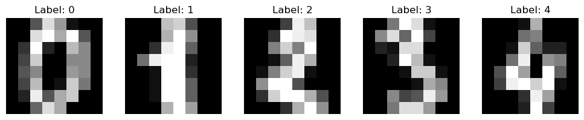
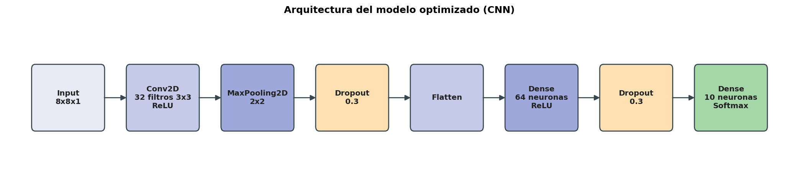

# Reconocimiento de dígitos con una CNN (Keras)

Clasificador de dígitos del 0 al 9 sobre imágenes de 8x8 píxeles en escala de grises, construido con una red neuronal convolucional (CNN) en Keras/TensorFlow. El proyecto compara un modelo base contra una versión optimizada con regularización (Dropout) y parada temprana (EarlyStopping).

## Dataset

`digitos_mnist_simple.xlsx` contiene 1797 imágenes de dígitos de 8x8 píxeles (64 columnas de intensidad de gris entre 0 y 16) más una columna `label` con el dígito real (0-9).



## Arquitectura del modelo optimizado



- **Conv2D (32 filtros 3x3)**: detecta patrones locales como bordes y trazos.
- **MaxPooling2D (2x2)**: reduce el mapa de características, quedándose con lo más relevante.
- **Dropout (0.3)**: apaga aleatoriamente el 30% de las neuronas en el entrenamiento para evitar sobreajuste.
- **Flatten**: convierte el mapa 2D en un vector 1D.
- **Dense (64, ReLU)**: combina las características extraídas.
- **Dropout (0.3)**: segunda capa de regularización.
- **Dense (10, Softmax)**: probabilidad de que la imagen corresponda a cada dígito.

## Resultados

| Modelo     | Accuracy en test | Loss en test |
| ---------- | ---------------- | ------------ |
| Base       | 95.83%           | 0.1296       |
| Optimizado | 98.33%           | 0.0646       |

El modelo optimizado usa más filtros, Dropout y EarlyStopping (`patience=5`, restaurando los mejores pesos), lo que sube el accuracy y reduce el loss a menos de la mitad frente al modelo base
(más detalles usando el generador de gráficos - script de python)
Y en el mismo, los pocos errores que quedan son entre el 8 y el 1, y entre el 9 y el 7.

## Cómo ejecutarlo

```bash
git clone <url-de-este-repositorio>
cd reconocimiento-digitos-cnn
pip install -r requirements.txt
jupyter notebook reconocimiento_digitos_cnn.ipynb
```

Ejecutar las celdas en orden. El notebook ya incluye las salidas (gráficos y métricas) de una ejecución previa, por lo que también se puede revisar sin volver a correrlo.

## Estructura del proyecto

```
reconocimiento-digitos-cnn/
├── reconocimiento_digitos_cnn.ipynb   # notebook principal
├── digitos_mnist_simple.xlsx          # dataset
├── generar_diagrama.py                # regenera img/diagrama_arquitectura.png (solo matplotlib, sin TensorFlow)
├── requirements.txt
├── README.md
└── img/                               # gráficos exportados del notebook
```

## Mejoras aplicadas para el portafolio

- Se agregó un diagrama de la arquitectura del modelo optimizado.
- Se comentó, capa por capa, el código de ambos modelos (base y optimizado).
- Se documentó el proyecto en este README para que se entienda sin tener que abrir el notebook.

## Autor

**Christopher Malebrán** — Desarrollador full-stack y estudiante de ciencia de datos.
[coderlabs.cl](https://coderlabs.cl) · christopher@coderlabs.cl
